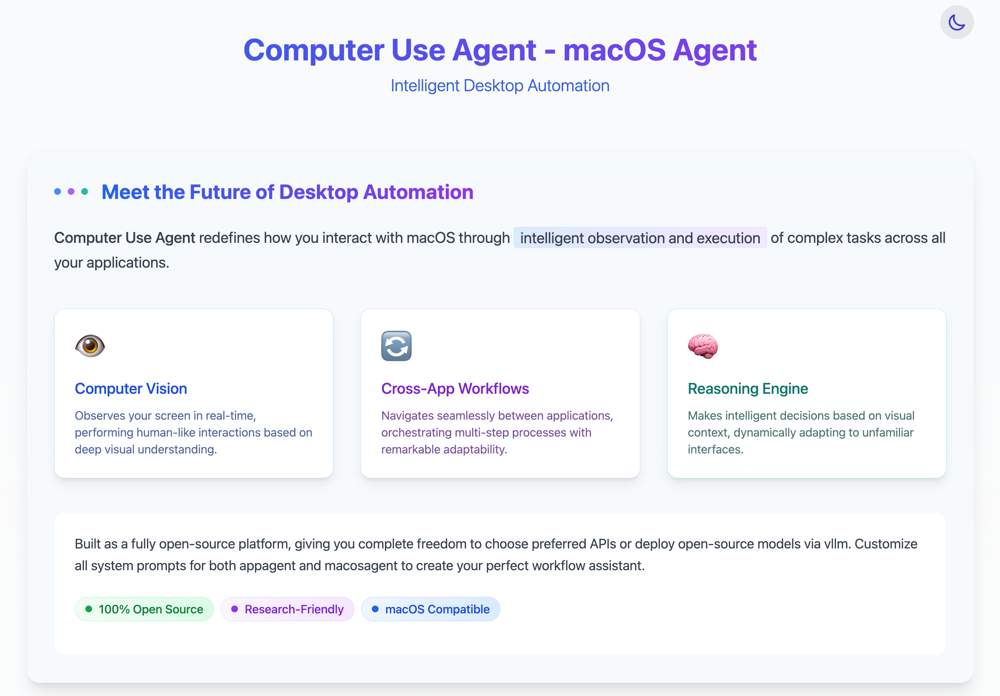

# Computer Use Agent Trace Viewer

A web-based visualization tool for Computer Use Agent traces, displaying the agent's thought process, actions, screenshots, and corresponding videos.



## 📋 Features

- Interactive timeline of agent activities with screenshots, thoughts, and actions
- Synchronized video playback
- Adjustable split view (drag to resize)
- Time-synchronized scrolling
- Multiple trace instances on a single page
- External JSON data support

## 🛠️ Prerequisites

- [Node.js](https://nodejs.org/) (v16.x or newer)
- npm (comes with Node.js) or [Yarn](https://yarnpkg.com/)

## 🚀 Getting Started

### 1. Clone the Repository

```bash
git clone https://github.com/Computer-use-agents/macos.git
cd macos
```

### 2. Install Dependencies

```bash
npm install
```

### 3. Start the Development Server

```bash
npm run dev
```

Visit [http://localhost:3000](http://localhost:3000) to see your trace viewer in action!

## 📁 Project Structure

The project uses the following structure for its data:

## Screenshots and Videos

Create the following directories: 

```bash
mkdir -p public  public/screenshots public/videos 
```

Place your screenshots and videos in the following directories:

- `public/screenshots/`: Contains the screenshots
- `public/videos/`: Contains the videos   

### JSON Data Files

The trace data is stored in JSON files under `src/data/` directory:
- `trace1.json`: Contains the first set of agent activities
- `trace2.json`: Contains the second set of agent activities

Each item in the trace data follows this format:

```json
{
  "timestamp": "2024-03-20T10:00:00Z",
  "screenshot": "/screenshots/image.png",
  "thought": "Agent is analyzing the current screen content...",
  "action": "click the button",
  "video": "/videos/test.mp4",
  "timeRange": {
    "start": 0,
    "end": 5
  }
}
```

## ✨ Customization

### Adding More Trace Viewers

To add more trace viewers, create a new JSON file in `src/data/` directory and import it in `app/page.tsx`:

```typescript
import trace3Data from '../src/data/trace3.json';

// Then use it in a TraceViewer component
<TraceViewer data={trace3Data} id="viewer3" />
```

### Modifying the Layout

- Adjust the default split ratio in the `TraceViewer` component by changing the `splitPosition` initial state
- Customize the styling using Tailwind classes in the component files

### Loading Data from API

To load data from an API instead of JSON files:

```typescript
'use client';
import { useState, useEffect } from 'react';
import TraceViewer from '../src/components/TraceViewer';

export default function Home() {
  const [data, setData] = useState(null);
  const [loading, setLoading] = useState(true);
  
  useEffect(() => {
    async function fetchData() {
      try {
        const response = await fetch('/api/traces/1');
        const data = await response.json();
        setData(data);
      } finally {
        setLoading(false);
      }
    }
    fetchData();
  }, []);
  
  if (loading) return <div>Loading traces...</div>;
  
  return (
    <main>
      {data && <TraceViewer data={data} id="viewer1" />}
    </main>
  );
}
```

## 🔧 Troubleshooting

### Images or Videos Not Loading

- Ensure the paths in your data match the actual file paths in the `public` directory
- Paths should be relative to the `public` directory (e.g., `/screenshots/image.png`, not `public/screenshots/image.png`)
- Check browser console for any 404 errors

### JSON Data Issues

- Verify your JSON files are properly formatted with valid JSON
- Make sure all required fields are present (timestamp, screenshot, thought, action, video, timeRange)
- Check that timeRange contains valid start and end values

## 🤝 Contributing

Contributions are welcome! Please feel free to submit a Pull Request.

## 📄 License

This project is open source and available under the [MIT License](LICENSE). 